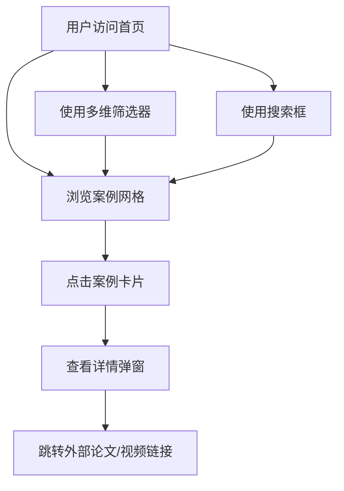

## 1. 产品概述
本项目旨在构建一个专业的具身数据叙事 (Embodied Data Storytelling) 案例库网站。通过多维度的分类体系，为研究人员、设计师和开发者提供一个系统化的案例检索、浏览和学习平台。

## 2. 核心功能

### 2.1 功能模块
1. **首页 (Home Page)**：集成多维筛选器、搜索框、案例网格流和案例详情弹窗。
2. **分类体系 (Taxonomy)**：基于 5W (What, How, Who, Why, Where) 框架的层级化标签系统。

### 2.2 页面详情
| 页面名称 | 模块名称 | 功能描述 |
|-----------|-------------|---------------------|
| 首页 | 侧边筛选器 | 允许用户按 Data Origin, Sensory Channels, Creative Task 等多个维度筛选案例。 |
| 首页 | 搜索模块 | 支持通过标题或关键字快速搜索案例。 |
| 首页 | 案例网格 | 展示案例缩略图、标题、年份及发表平台，支持响应式布局。 |
| 首页 | 详情弹窗 | 点击案例卡片弹出，展示案例的完整维度标签、描述、外部链接及大图预览。 |

## 3. 核心流程
用户进入网站后，可以通过侧边的多级筛选器或顶部的搜索框锁定特定类别的案例。点击案例卡片后，通过 Modal 形式查看该案例的详细元数据和外部资源。

## 4. 用户界面设计
### 4.1 设计风格
- **主色调**：Slate-900 (文字), Indigo-600 (高亮/激活态), Gray-50 (背景)。
- **按钮风格**：扁平化、轻微圆角 (rounded-md)，交互时有平滑的缩放或颜色过渡。
- **字体**：标题使用具有学术气质的 Serif 字体（如 Playfair Display），正文使用清晰的 Sans-serif（如 Inter）。
- **布局风格**：典型的侧边栏 + 内容区布局，内容区采用响应式卡片网格。

### 4.2 页面设计概览
| 页面名称 | 模块名称 | UI 元素 |
|-----------|-------------|-------------|
| 首页 | 侧边筛选器 | 层级折叠列表，带 Checkbox 和数量统计。 |
| 首页 | 案例卡片 | 优雅的阴影效果 (shadow-sm)，悬停时提升 (hover:shadow-md)。 |
| 首页 | 详情弹窗 | 磨砂玻璃背景遮罩，内容居中，清晰的标签云展示。 |

### 4.3 响应式设计
- **桌面端**：侧边栏固定或可收起，内容区 3-4 列网格。
- **移动端**：侧边栏转为顶部抽屉或筛选按钮，内容区 1-2 列网格，优化触摸点击。
