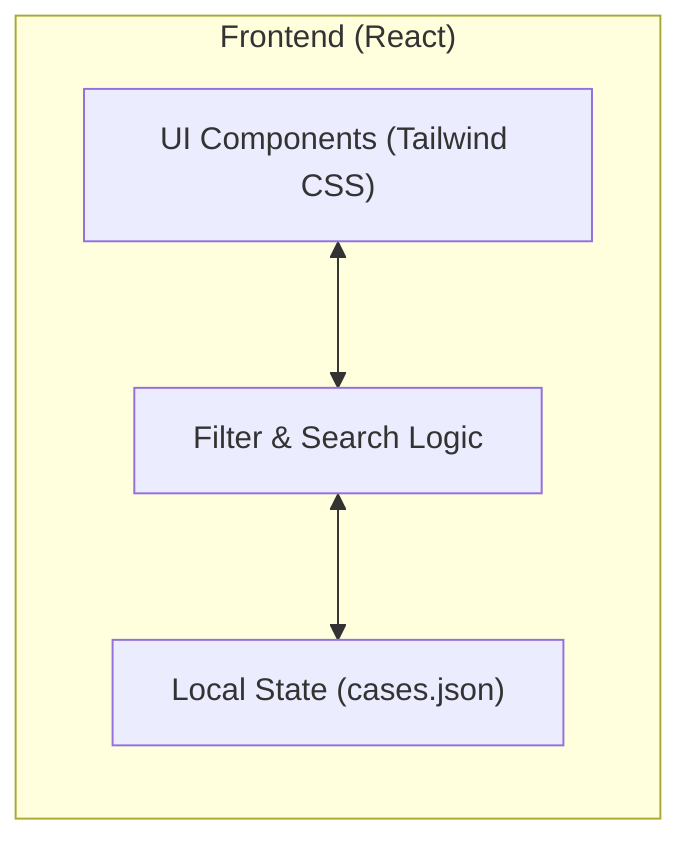

## 1. 架构设计
本项目采用单页应用 (SPA) 架构，前端负责所有的数据加载、筛选过滤和界面渲染。



## 2. 技术选型
- **前端框架**: React@18
- **构建工具**: Vite
- **样式方案**: Tailwind CSS @3
- **交互动画**: Framer Motion (用于弹窗和过滤动画)
- **数据源**: 静态 JSON 文件 (`data.json`)

## 3. 路由定义
| 路由 | 用途 |
|-------|---------|
| / | 唯一的应用入口，包含所有核心功能。 |

## 4. 数据模型
### 4.1 案例对象定义 (TypeScript)
```typescript
interface Case {
  title: string;
  venue: string;
  link: string;
  year: number | null;
  illustration: string;
  tags: {
    [mainCategory: string]: {
      [subGroup: string]: string[];
    };
  };
}

interface Taxonomy {
  [mainCategory: string]: {
    [subGroup: string]: string[];
  };
}
```

## 5. 开发计划
1. **环境初始化**：配置 Vite + React + Tailwind。
2. **数据集成**：导入 `data.json` 并建立数据访问层。
3. **组件开发**：
    - `FilterPanel`: 处理多级筛选逻辑。
    - `CaseGrid`: 响应式案例列表。
    - `CaseCard`: 单个案例的展示单元。
    - `DetailModal`: 详情展示。
4. **功能集成**：实现筛选、搜索和详情展示的联动。
5. **部署优化**：配置 GitHub Actions 自动部署至 GitHub Pages。
